# 僵尸快跑 (Zombies Run)

## version-1.0

- **版本介绍**
基本初步完成功能预设，包含：6张植物卡牌，4种僵尸，1战斗场景，商店系统，金钱系统，花园系统，一个主界面，设置选项，难度选择，冒险模式。

- **优化改动**
1. 优化1
将草坪向左迁移，使小推车在最左侧显示，并且更新卡牌的模型，与种下来的模型同步，增加撑杆跳僵尸，减少第一波僵尸的生成数量。
2. 优化2
小推车的运行逻辑有错误，新增初始界面：提供模式选择和设置调节，新增暂停和二倍速功能，并且添加背景音乐：/home/sheen/pvz-game/01.开始背景音乐_爱给网_aigei_com.MP3。

- **局内展示**
1. 界面
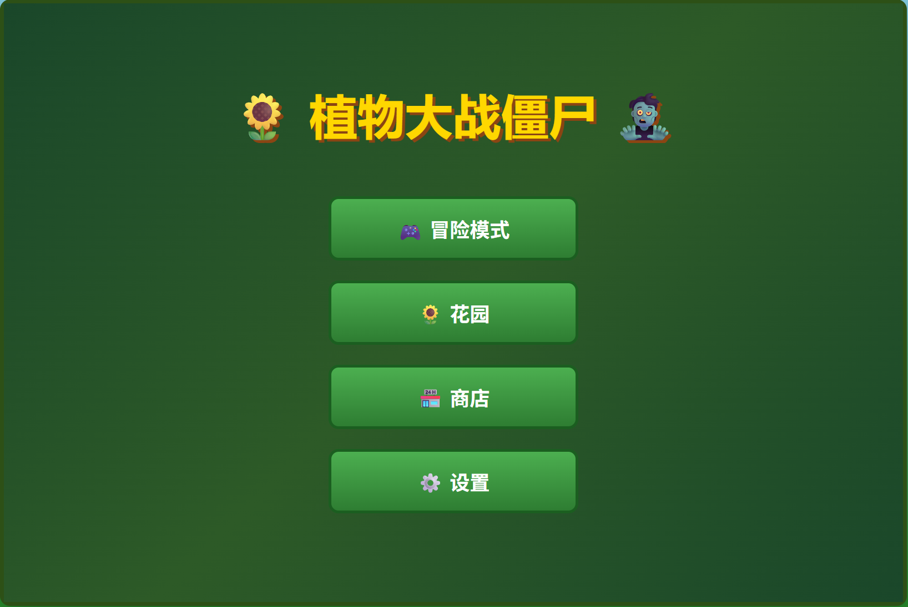
2. 战斗系统
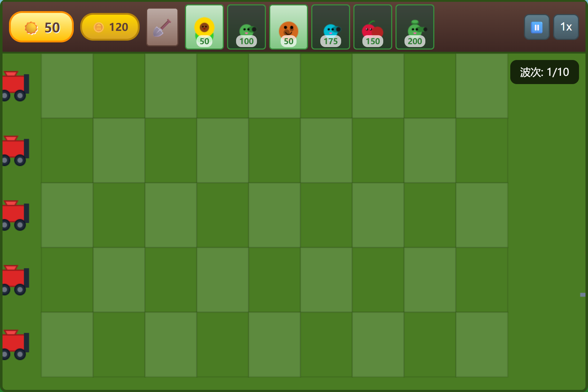
3. 花园系统
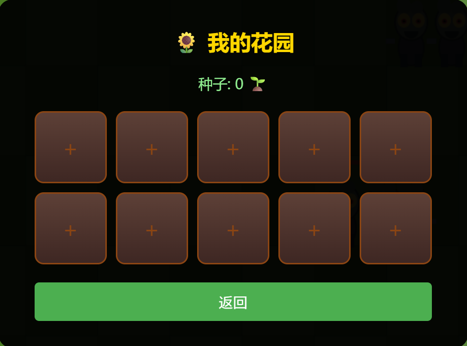
4. 商店系统
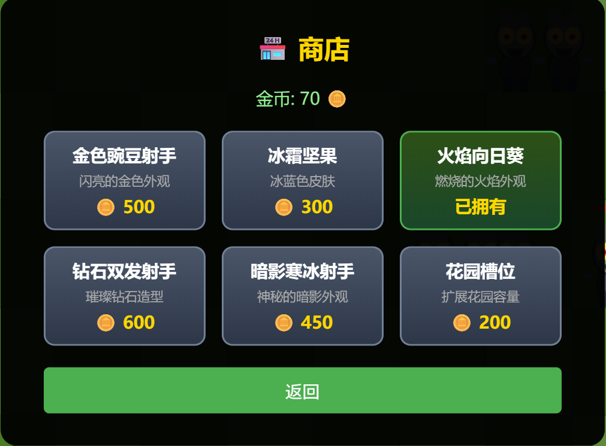

## version-2.0

- **版本介绍**
新增关卡、图鉴系统、3种植物、2种僵尸；优化商店、花园系统；优化战斗体验，有测试玩家反馈过难，简化难度。

- **优化改动**
1. 优化1
铲子位置移动到植物卡片左侧，优化双发射手形象给他加一个小帽子，增添一个花园系统，商店系统，在战斗的时候击杀僵尸有1%的概率掉落种子，在花园里面可以种植成随机植物来养成，增加金币，银币系统，击杀僵尸有概率掉落钱，可以在商店购买植物皮肤。
2. 优化2
僵尸要在开始20s后才会生成，继续优化小推车激活逻辑，还是有问题，而且皮肤没有生效，购买皮肤后要有新的特效，开启2倍速植物cd没有倍速要优化，每个模块为其单独设计一个背景，不要全都使用战斗时候的背景，同时设置植物卡槽上限为7，当拥有的植物数量超过7，在战斗开始之前从牌库里面选择七张植物上阵。同时在一关卡胜利之后弹出的界面可以选择下一关或者返回大厅。同时花园系统里面，优化为：种下一个种子后需要等待1小时之后成熟，成熟后可以领取，成熟时随机为三种稀有度，不同植物，不同稀有度都可在商店出售，且出售价格不同，随稀有度提升。图鉴系统里面的图案与战斗时的建模同步，所有植物和僵尸都要与战斗时候的建模同步。优化撑杆跳僵尸模型：手里的杆子改为一根直直长长的杆子。
3. 优化3
各模块还是没有背景，要有个环境背景，例如花园背后有个场景，而不是冒险模式的背景，优化每个模块，设计专属背景，独占整个页面，后面不要显示别的东西。
4. 优化4
不要出现任何滚动条，战斗开始倒计时放在波次下方，放大显示画面到全屏幕大小，还有所有文字被选中会有输入的光标，我不要这种。

- **局内展示**
1. 关卡系统
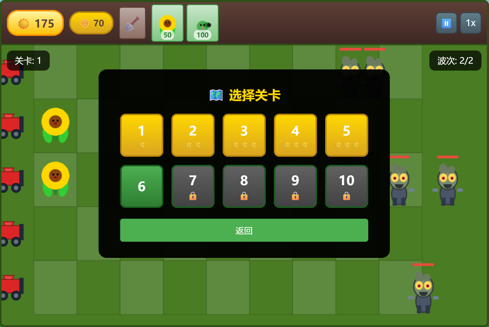
2. 战斗优化
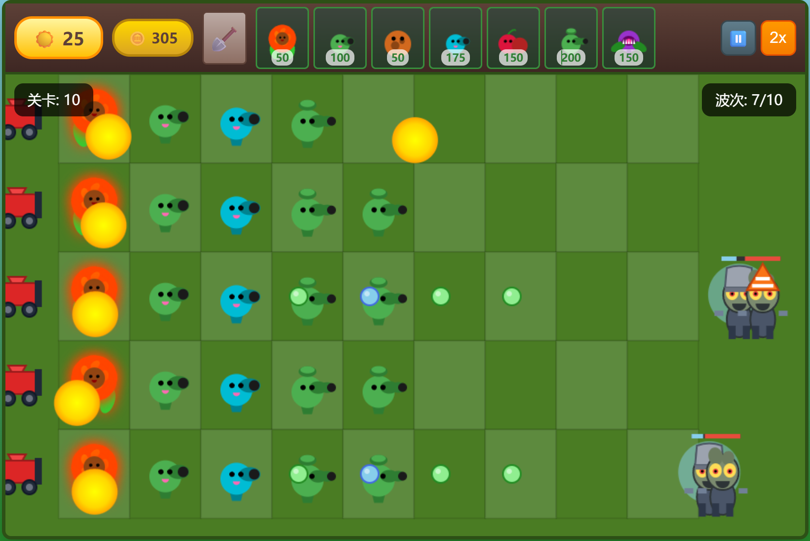

## version-4.0

- **版本介绍**
响应式布局优化，兼容手机端，支持横屏自动切换，修复战斗音乐文件路径，优化游戏启动流程。

- **优化改动**
1. 优化1
添加响应式布局，适配平板、手机等移动设备，竖屏时显示横屏提示。
2. 优化2
修复战斗音乐文件路径错误（fight.html -> fight.mp3）。
3. 优化3
优化游戏启动流程，启动时预加载所有音频资源，进入游戏时自动播放主界面音乐。

- **局内展示**
1. 横屏提示
2. 响应式布局

## version-3.0（最终版）

- **版本介绍**
新增4种僵尸、各场景独立音乐；优化商店、花园系统、战斗体验、主界面样式、全屏显示。

- **优化改动**
1. 优化1
优化主界面动画和按键，新增动态移动效果。
2. 优化2
在主界面的时候播放/home/sheen/pvz-game/main_background.mp3
在花园的时候播放/home/sheen/pvz-game/garden.mp3
在冒险模式选卡的时候播放/home/sheen/pvz-game/fight_prepare.mp3
在冒险模式战斗的时候播放/home/sheen/pvz-game/fight.html
严格完成上述逻辑。
3. 优化3
选卡界面不要显示后面的/7，只显示（已选植物数量/最多可选植物）；移除主界面豌豆子弹移动的效果。
4. 优化4
把主界面设置按键改到右下角，图鉴改到右上角，两个按钮都改为正方形，并且适当缩小一点

- **局内展示**
1. 战斗优化
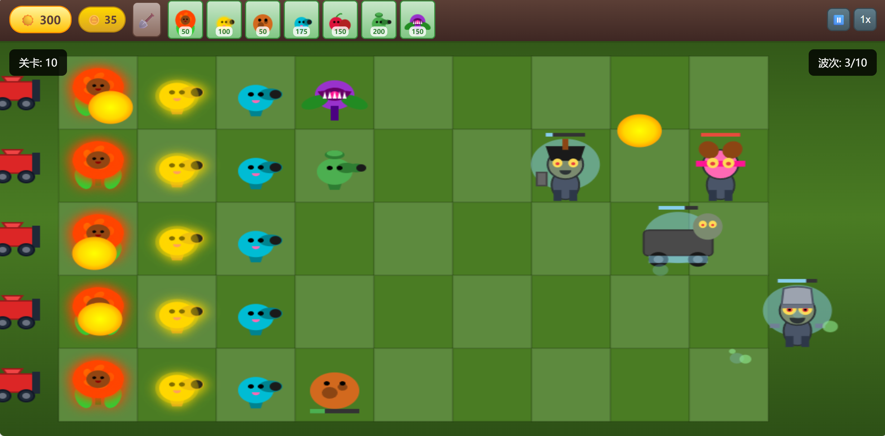
2. 主界面
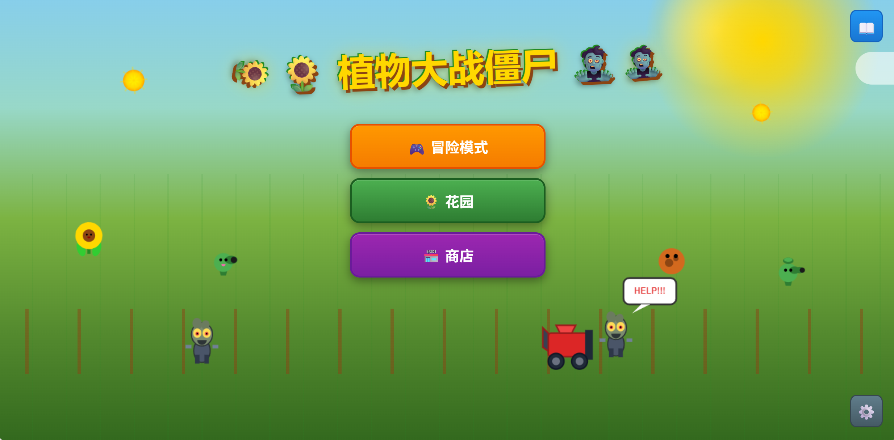
3. 花园
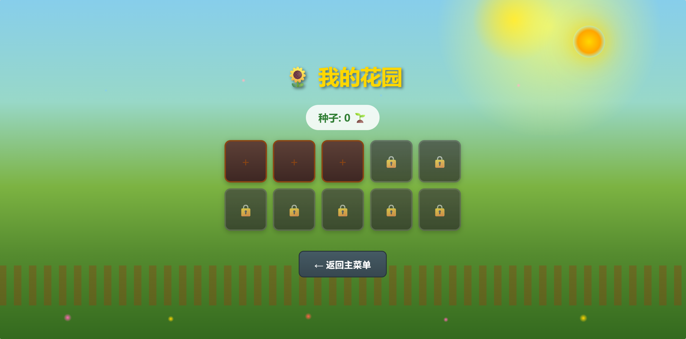
4. 商店
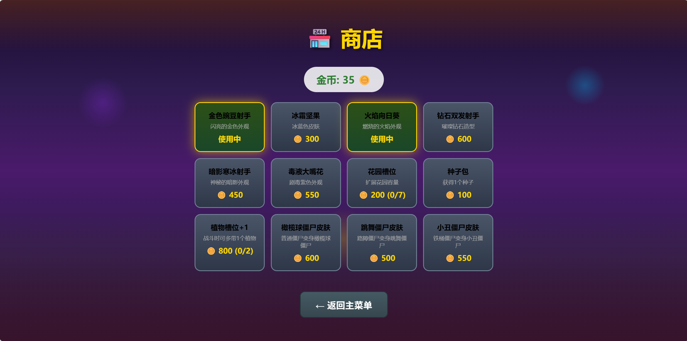
5. 图鉴
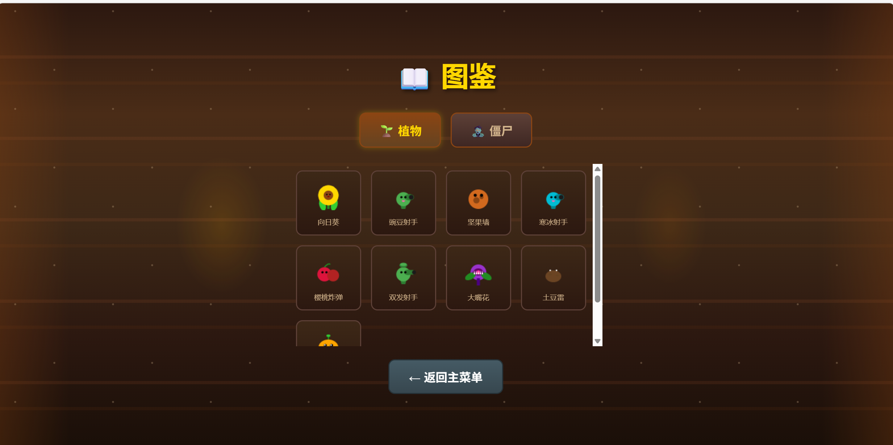
